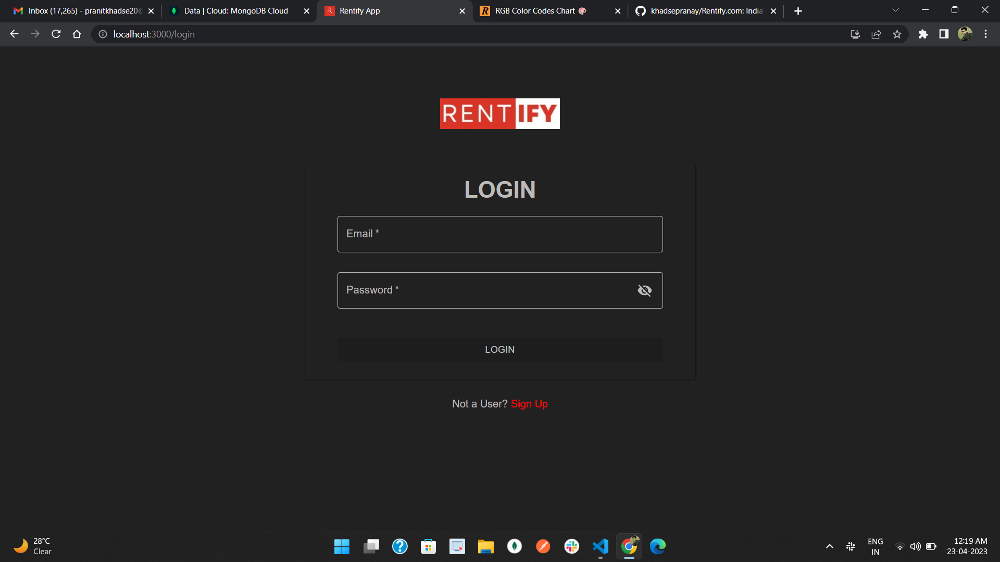

# RentoMojo Clone (named as Rentify.com)
Got a collaborative project to clone rentomojo website. We have completed this project within 4 days.
Rentomojo is an online rental platform that provides furniture, appliances and electronics on a monthly rental basis.

In this project we have made the foolowing things :
 - Home Page
 - Navbar
 - Admin Page
 - Signup Page
 - Various project Pages
 - Cart Page
 - Order Page

---

### [click here to run live demo](https://rentify-khadsepranay.vercel.app/)

## Tech stacks used :
* **React**
* **Express**
* **MongoDB**
* **Material-UI**
* **Chakra-UI**
* **Razor-Pay**

***
## Landing Page :

## Log In page :

## Sign Up page :

## Products Page:

## Cart Page : 

## Order Successful Page : 

## Footer Page :

## Learnings :
- Real-life implementation of React, Express, MongoDB, Redux, MaterialUI, ChakraUI and RazorPay.
- Time-management and Accountability.
- Learn to work in pressure.
- Learn to tackle problems and how to keep our-self motivated.
  
## Team Members : 

- Pranay Khadse - fw20_0117
  
- Vinayak Hiwase - fp05_229

- Rohini Kushwaha - fw17_0925

- Arjun Yadav - fw18_0903

- Tarun Kumar Sao - fw20_1259

